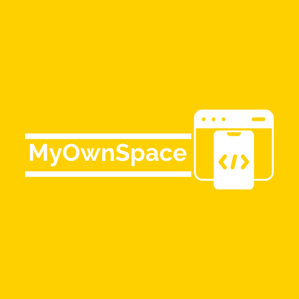
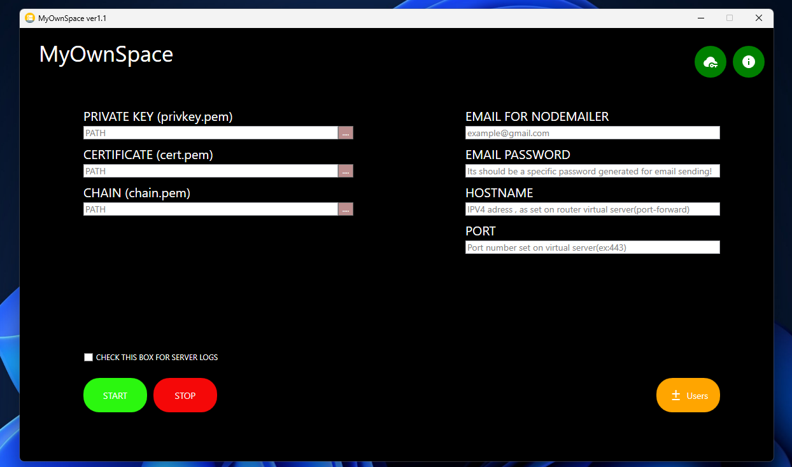
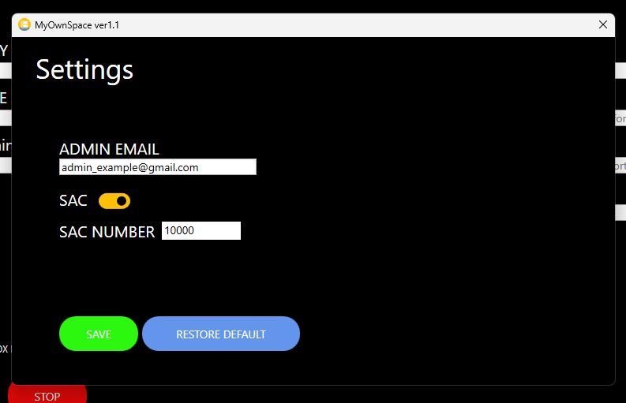
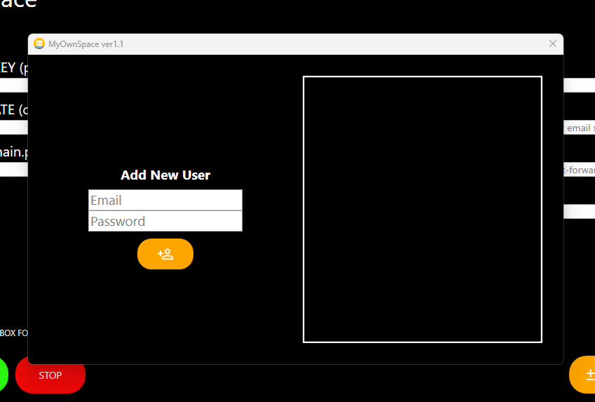
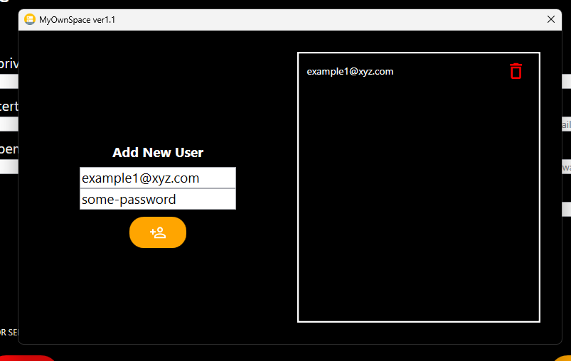

<p align="center">
  
</p>

<h1 align="center">MyOwnSpace</h1>

<p align="center">
Open-source self-hosted cloud storage platform with multi-client synchronization.
</p>

<p align="center">


</p>

---

## 📌 Overview

**MyOwnSpace** is an open-source platform that allows users to host their own private cloud storage server and synchronize files across desktop, mobile and web clients.

The platform is designed to be easy to deploy on Windows using a dedicated graphical server application, while also allowing manual deployment on Linux environments.

---

## ✨ Features

* Self-hosted cloud storage platform
* Dedicated **Windows server GUI application** built with WPF / .NET
* Cross-platform clients built using Flutter & Dart
* Windows / Linux / Android / Web apps
* HTTPS only communication (certificate required)
* Unlimited user accounts
* Shared storage model (all users access the same storage folder)
* Supports all file types *(except folders)*
* Material Design based UI (Material 2 / Material 3)
* Email verification on first login (desktop/mobile/linux)
* Permanent verification flow on Web
* Brute-force protection system with automatic server shutdown
* Admin email alerts when server shuts down
* Admin panel for:

  * user management
  * server configuration
  * IP attack threshold configuration

---

## 🧱 Architecture

```
Clients (Flutter)
   │
HTTPS
   │
Node.js Server
   │
SQLite Database
   │
Shared Storage Folder
```

---

## ⬇️ Installation

### 🪟 Windows Server (Recommended)

1. Download `my_own_space_win_server_installer.exe`
2. Run the installer and complete setup
3. Launch the server application **as Administrator**
4. Configure:

   * https certificate
   * hostname, server IP(internal IPv4) or domain
   * server port
   * email and password for sending verification code(via Nodemailer)
     - password should be generated specifically for this use, you can search the steps for your email provider
   * in the top right corner click the key button, here you can set:
     - admin email(any email addres you want)
     - ip brute-force threshold(SAC), not necessary if low amount of users
   * back to the main interface click on +- Users and add as many as you want
  
5. Start the server

---

### 🐧 Linux Server (Manual Setup)
Requirements:

* Node.js installed, see https://nodejs.org/en
* Database editor

Steps:
  1. Get my_own_space_server_code
  2. Get my_own_space_web
  3. Put my_own_space_web inside my_own_space_server_code and move this to where you want your server files to be
  4. *VERY IMPORTANT* Inside my_own_space_server_code add an empty folder named "main"
  5. Now inside my_own_space_server_code identify this 2 files admin_db.sqlite and myOwnSpaceDb.sqlite
  6. Use any database editor that supports SQLite read/write/alter operations
  7. Open and connect to myOwnSpaceDb.sqlite, here you gonna edit:
     
     * Table INPUT row with ID = 1:
       - EMAIL(for sending verification code)
       - PASSWORD for that email
       - HOSTNAME(IP or Domain)
       - PORT
       - PRIVATE_PATH, CERTIFICATE_PATH and CHAIN_PATH
       - Save

     * Table users, you gonna add new rows:
       - only add EMAIL and PASSWORD for users, all other columns get modified by the server!
       - Save
         
  8. Open and connect to admin_db.sqlite, here you gonna edit:

     * Table admin_table row with ID = 1:
        - MAX_CONN_DAY = 10000 default, modify for more or less, if you wish to have Automatic shutdown on brute-force attack detection
        - KEY, leave empty, modified only by the server
        - ALLOW_SHUTDOWN = 0(if you dont want the server to not close if MAX_CONN_DAY is reached) and 1(for the server to close)
        - EMAIL(Admin)
        - Save
          
  9. Final step:
  ```bash
      cd my_own_space_server_code
      node db_verify.js
      node server.js
  ```
---

## 🌐 Port Forwarding & HTTPS

To allow external access:

* Forward the configured server port and internal IPv4 address in your router
* Make sure you have a domain with dynamic IP or a static IP!
* Get a valid HTTPS certificate for domain/IP
* Ensure firewall allows incoming connections

---

## 💻 Client Applications

Clients are available for:

* Windows
* Linux
* Android
* Web

All clients except Web connect using:

```
At the start of the app:
  - If domain, address = https://yourdomain.xyz:port
  - If static IP, address = https://yourip:port
User Email
User Password
Verification Code(sent via email)
```
For Web:
```
In search bar:
  - If domain, put https://yourdomain.xyz:port
  - If static IP, put https://yourip:port
After that login using email and passowrd
Verification Code(sent via email)
```
---

## 📷 Screenshots

### Windows Server Application
### 🖥️ Windows Server Application

<details>
<summary>📷 Win-Server Screenshots </summary>

<br>

<p align="center">
  <a href="assets/p1.png">
    <br>
    <sub><b>Step 1: Initial Setup Page</b></sub>
  </a>
</p>

<p align="center">
  <a href="assets/p2.png">
    <br>
    <sub><b>Step 2: Admin Configuration</b></sub>
  </a>
</p>

<p align="center">
  <a href="assets/p3.png">
    <br>
    <sub><b>Step 3: Add User Page</b></sub>
  </a>
</p>

<p align="center">
  <a href="assets/p4.png">
    <br>
    <sub><b>Step 4: Final</b></sub>
  </a>
</p>

</details>

### 🪟🐧📱🌐Client Applications

<details>
<summary>📷 Windows/Linux/Android/Web Screenshots </summary>

<br>

<p align="center">
  <a href="assets/p1.png">
    <br>
    <sub><b>Step 1: Initial Setup Page</b></sub>
  </a>
</p>

<p align="center">
  <a href="assets/p2.png">
    <br>
    <sub><b>Step 2: Admin Configuration</b></sub>
  </a>
</p>

<p align="center">
  <a href="assets/p3.png">
    <br>
    <sub><b>Step 3: Add User Page</b></sub>
  </a>
</p>

<p align="center">
  <a href="assets/p4.png">
    <br>
    <sub><b>Step 4: Final</b></sub>
  </a>
</p>

</details>

---

## 📁 Repository Structure

```
/my_own_space_desktop
/my_own_space_mobile
/my_own_space_server_app
/my_own_space_server_code
/my_own_space_web
/assets
LICENSE
README.md
```

---

## 🔐 Security

* HTTPS enforced communication
* Email verification login flow
* Automatic shutdown on brute-force attack detection
* Admin alert email system

---
